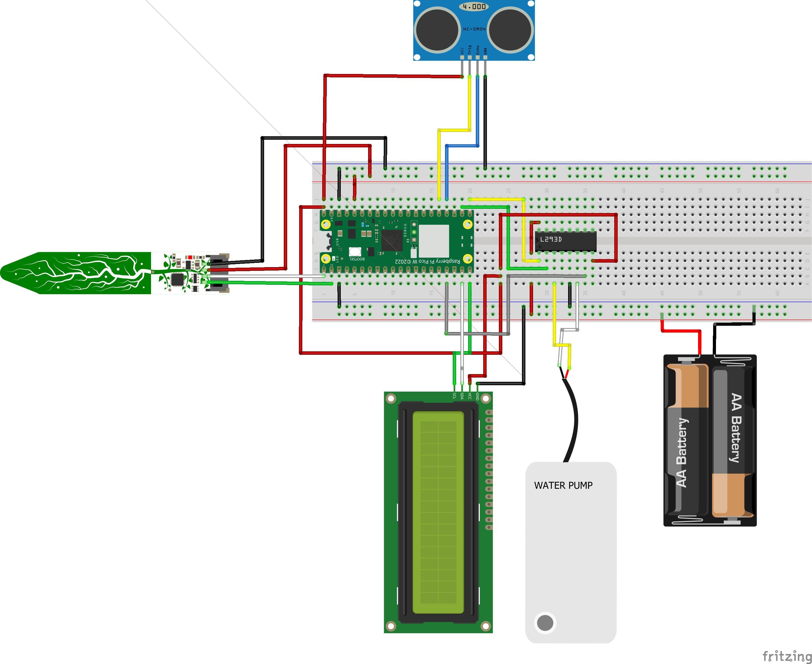
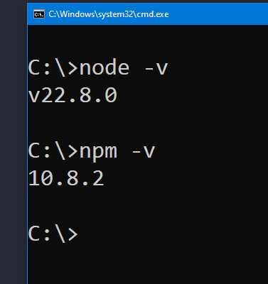

# Smart Plant System
Name: **Viktor Rickardsson**  
Student ID: **vr222im**  

## Overview
With this project you will be able to create a smart plant system. 
This system monitors soil moisture, temperature, and water levels, automatically watering plants when needed while sending data to InfluxDB for monitoring and visualization via Grafana.

**Estimated time:** 6 hours 


## Objective
After having multitple plants die on me I created an IOT setup for it.
Either I forget to water them or I water them to much so they drown but no longer!

I hope this will make my plants survive a bit longer and perhaps I'll even learn how often plants should be watered.

## Features

- **Automatic Watering**: Waters plants when soil moisture drops below 400 (configurable threshold)
- **Multi-Sensor Monitoring**: 
  - Soil moisture and temperature via I2C soil sensor
  - Water level monitoring using ultrasonic sensor
  - LCD display of last readings
- **IoT Connectivity**: 
  - WiFi connectivity for remote monitoring
  - InfluxDB data logging for historical analysis
- **Safety Features**: 
  - Pump cooldown period (**Default:** 12 hour between watering cycles)
  - Timeout protection for ultrasonic sensor readings

## Material


| Component                       | Description                            | Image | COST | 
| ------------------------------- | -------------------------------------- | ----- | ---- |
| [Pico W ](https://www.electrokit.com/raspberry-pi-pico-w)  | Microcontroller running MicroPython   |  | 8 € |
| [Stemma Soil Sensor](https://www.electrokit.com/jordfuktighetssensor-kapacitiv-i2c)  | Measures soil moisture and temperature | | 11 € |
| [Ultrasonic Sensor (HC-SR04)](https://www.electrokit.com/avstandsmatare-ultraljud-hc-sr04-2-400cm) | Measures water tank level |  | 5 € |
| [16x2 I2C LCD](https://store.freenove.com/products/fnk0079)  | Displays sensor readings  |  | 8 € |
| [Water pump ](https://www.electrokit.com/drankbar-pump-3v)  | Waters the plant  |   |   5 € |
| [Motor driver chip](https://www.electrokit.com/en/l293dn-dip-16-drivkrets-push-pull-4-kan)  | Pump controller   |   | 2 € |

**Minor materials**  

Jumper Wires  
Tube for pumping water  
USB cable for Pico  
4 * 1.5V batteries  
Connect via Breadbord or solder the wires(highly recommended).

#### **Total Amount ≈ 55 €**

### Putting everything together   

Below is the schematic for my setup. 
The soil sensor should be inserted 1–2 cm into the soil of your flower pot.
Mount the ultrasonic distance sensor above your water reservoir, facing downward to measure the water level.
Place the pump inside the reservoir to draw water when needed.


```
LCD Display:    SDA = Pin 14, SCL = Pin 15
Soil Sensor:    SDA = Pin 0,  SCL = Pin 1
Ultrasonic:     Trigger = Pin 19, Echo = Pin 18
Water Pump:     Control = Pin 13, 16, 17
```

## Computer Setup

### Node.js 

1. Go to https://nodejs.org/
2. Download the LTS - version
3. Install standard settings with npm
4. When it's done. type the following in your terminal to see that it' installed
``` 
node -v
npm - v
```
It should look like this. Yours might be newer.



### Install Visual Studio Code
1. Go to https://code.visualstudio.com
2. Download it for your system

### Install Pymakr extension in VS Code
1. Open VS Code
2. Go to extensions (CTRL+SHIFT+X)
3. Search for Pymakr
4. Install Pymakr

### Install MicroPython Firmware

1. [Download MicroPython Firmware](https://www.raspberrypi.com/documentation/microcontrollers/)
2. Click MicroPython
3. Select which board you have and download the  
4. To program your device, follow these steps:
- Push and hold the BOOTSEL button while connecting your Pico with a USB cable to a computer. Release the BOOTSEL button once your Pico appears as a Mass Storage Device called RPI-RP2.

- Drag and drop the MicroPython UF2 file onto the RPI-RP2 volume. Your Pico will reboot. You are now running MicroPython.

### Setup Pymakr
1. In VS Code click on your newly installed Pymakr extension which you have on the left side of the program.
2. Click on the + and then Create new project, Add Device and choose your USB.
3. **Upload files** to your Pico W:
   - Main script (`main.py`)
   - Configuration files (`keys.py`, `connections folder`, `boot.py`)
   - Hardware file (`sensorReads.py`)
   - Required library files
4. **Configure services**:
   - Configure InfluxDB instance and bucket
   - Update `keys.py` with your credentials
  
### Setup Discord Webhook
1. In Discord, create a new server by clicking the + below all your active servers.
2. Click Create my Own
3. You will as default get 1 default text channel called General. To the right of this. Click the cogwheel.
4. Click Integrations -> Create Webhook -> Webhook name and then Copy Webhook URL. Paste this in the keys.py file where it says DISCORD_URL

### Libraries
- `LCD Folder` - I2C LCD display driver
- `soil_sensor folder` - STEMMA soil sensor driver
- `mqtt.py` - MQTT driver from PYCOM

### Configuration Files
**`wifiConnection.py`** - WiFi connection utilities  
**`mqttConnection.py`** - MQTT connection utilities    
**`keys.py`** - Configuration constants:

```python
# Wireless network
WIFI_SSID = "WIFI_SSID"           # Enter your WIFI SSID
WIFI_PASS = "WIFI_PASSWORD"       # Enter your WIFI PASSWORD

# MQTT keys
MQTT_BROKER = "serveradress"      # Change to your server  
MQTT_PORT = 1883                  # Default port is 1883  
MQTT_USER = "admin"               # Change this
MQTT_PASS = "password"            # Change this
MQTT_TOPIC = "TopicName"          # Any unique name
CLIENT_ID = "Can be anything"     # Any unique name

# Discord
DISCORD_URL = "URL"               # Your discord webhook URL.

```

## Platform

I chose to use TIG stack, mostly because I could do this with docker which I need to learn more about. 
**TIG** stands for 3 different services: 

**Telegraf** - Collects metrics, logs and events  
**InfluxDB** - Store the data collected by Telegraf  
**Grafana** - Visualizes the data stored in InfluxDB

The program published data to an MQTT topic, for example sensor/soil-data.

**Telegraf** which is running on the server subscribes to this topic via MQTT. Here it is parsed and converted into **InfluxDB** protocol.

The data is now saved in your **Influx** database.

In **Grafana** you create queries for the data saved in InfluxDB. 

##  The code
This function gets the average of 10 sensor reads since cheap sensors may be a bit unstable and send a value that is completely off. This helps solve it a bit. 
```python
def getAverage(avgValue, samples = 10):
    results = []
    for i in range(samples):
        value = avgValue()
        if value != -1: # Error code
            results.append(value)
        time.sleep(0.05) # Delay on each loop helps stabilize sensor reads.
    if results:
        return sum(results) / len(results)
    return -1
```
The ultrasonic sensor reads the range between it self and the water. So when it has highest value is when the water is at it's lowest. This reverses it and also transform it to a percentage instead of distance to the water.

```python
def waterLevel(maxLevel = 20, minLevel = 37):
    distance = getAverage(getDistance)
    water_level = (minLevel - distance) / (minLevel - maxLevel) * 100
    return int(water_level)
```

## Transmitting the data / connectivity

Here are some variables you can set to make sure it works like you want it.
Depending on your soil sensor you might want to change the **MOISTURE_THRESHOLD** value, how often you want the pump to water the plants.
```python
MOISTURE_THRESHOLD = 400             # Trigger watering below this level
PUMP_INTERVAL = 12 * 60 * 60 * 1000  # Minimum time between watering (12 hour) saftety precaution
PUMP_DURATION = 5                    # How many seconds the pump will run
LCD_INTERVAL = 30 * 1000             # 30 second interval until next LCD screen update
SEND_INTERVAL = 1 * 60 * 60 * 1000   # Timer to send data to InfluxDB
```

I use WIFI which it tries to connect to before it does anything else. If it has lost it's connection it will try to reconnect to WIFI and MQTT.   
If the water level drops below a set threshold (default: 30%), a notification will be sent to your Discord webhook. A message will then appear in your Discord server, reminding you to refill the water reservoir.


## Presenting the data

[Grafana](https://grafana.rickardssons.se/public-dashboards/24dd0d5f85534901976ab4207556e5a6)


**Discord webhook**    


### Updates 
**Temperature**, **Water level** and **Moisture** is saved to InfluxDB once every hour.  
Every time the pump activates, the following values are saved to InfluxDB:  
- **Temperature**  
- **Moisture**  
- **Water level**  
- **Pump counter**
  
The LCD screen is updated every 30 seconds to make it feel more alive.  

#### InfluxDB Metrics
The system logs the following metrics:
- `moisture` - Current soil moisture level 
- `temperature` - Soil temperature in Celsius 
- `water_level` - Water reservoir level in % 
- `pump_counter` - How often the pump has been activated.


### LCD Display
Somewhat real-time display shows:
- Line 1: Soil moisture level
- Line 2: Water reservoir level

## Finalizing the design

Here you can see how pictures with a long dead plant just to see my setup, which is far from great. It's just a working concept. For a more permanent solution I suggest longer cables so batteries, pico and LCD dont have to sit on the edge of the pot.


## Operation
1. **System starts** and connects to WiFi & MQTT
2. **Sensors initialize** and begin continuous monitoring
3. **LCD displays** current readings every 30 seconds
4. **Automatic watering** triggers when:
   - Soil moisture < 400 AND
   - At least 12 hours since last watering
5. **Data logging** sends metrics to InfluxDB hourly via MQTT
6. **MQTT communication** allows remote monitoring via Grafana

## Troubleshooting

### Common Issues
- **No I2C devices found**: Check wiring and power connections
- **WiFi connection fails**: Verify credentials in `keys.py`
- **InfluxDB errors**: Check URL, token, and bucket configuration
- **Ultrasonic timeouts**: Ensure sensor has clear line of sight

### Debug Information
The system outputs detailed logging including:
- I2C device detection
- Distance measurements
- Sensor readings
- Network operation status
- Pump activation events

## Safety Notes
- Ensure water pump is properly rated for your power supply
- Use appropriate protection for electronics around water
- Monitor initial operation to verify proper moisture thresholds

## Future Enhancements
- Multiple plant support with individual sensors
- Better wire management
- Remove batteries and use USB to power pump
